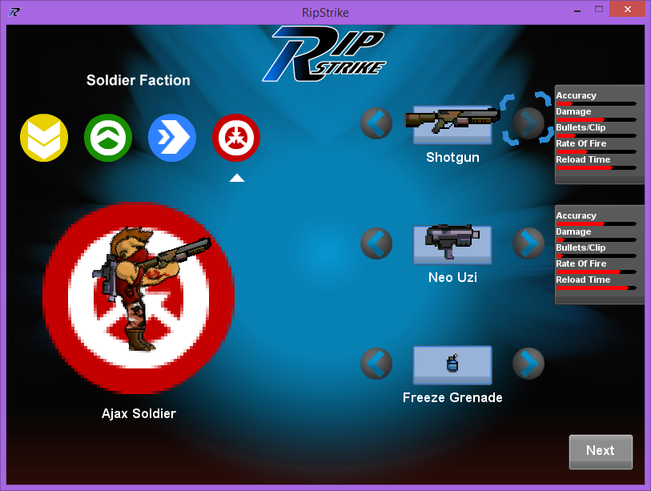
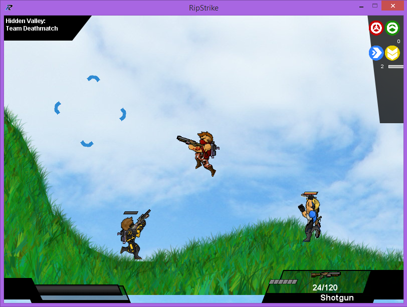
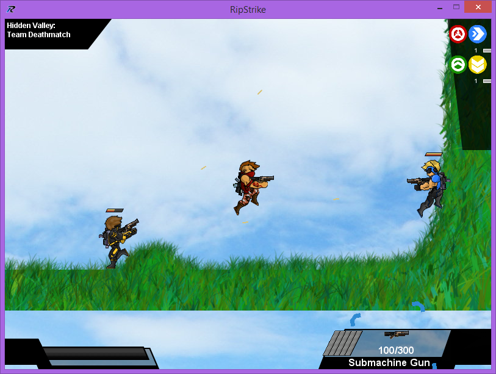

Ripstrike
=========

Desktop Java Game

I started this game over the summer of 2012 before starting college. As a last hurrah of working
in Java, since I wanted to move over to XNA and other Microsoft technologies, I made a platformer/
shooter kind of game that had more sophisticated terrain, a certain level of AI, and a greater variety
of parameters/options to play the game. I also wanted better graphics!

Again, the WASD keys control the character, and you shoot with the left mouse button. You can jump with
space and throw grenades with the right mouse button as well. There's only free for all and team deathmatch
implemented. Again, the game is pretty playable although it is lacking. I spent a lot of time on the graphics
and making a seperate map editing program.

The project was done in Eclipse, back with Java SE 1.6.

All graphics and image assets are mine: I made all of them.

Screenshots
==========

 

 

 

The MIT License (MIT) 
==========
Copyright © 2014 Nick Chavez

Permission is hereby granted, free of charge, to any person obtaining a copy of this software and associated documentation files (the “Software”), to deal in the Software without restriction, including without limitation the rights to use, copy, modify, merge, publish, distribute, sublicense, and/or sell copies of the Software, and to permit persons to whom the Software is furnished to do so, subject to the following conditions:

The above copyright notice and this permission notice shall be included in all copies or substantial portions of the Software.

THE SOFTWARE IS PROVIDED “AS IS”, WITHOUT WARRANTY OF ANY KIND, EXPRESS OR IMPLIED, INCLUDING BUT NOT LIMITED TO THE WARRANTIES OF MERCHANTABILITY, FITNESS FOR A PARTICULAR PURPOSE AND NONINFRINGEMENT. IN NO EVENT SHALL THE AUTHORS OR COPYRIGHT HOLDERS BE LIABLE FOR ANY CLAIM, DAMAGES OR OTHER LIABILITY, WHETHER IN AN ACTION OF CONTRACT, TORT OR OTHERWISE, ARISING FROM, OUT OF OR IN CONNECTION WITH THE SOFTWARE OR THE USE OR OTHER DEALINGS IN THE SOFTWARE.
